# My WAZUH solution	
### wazuh + sysmon + winlogbeat

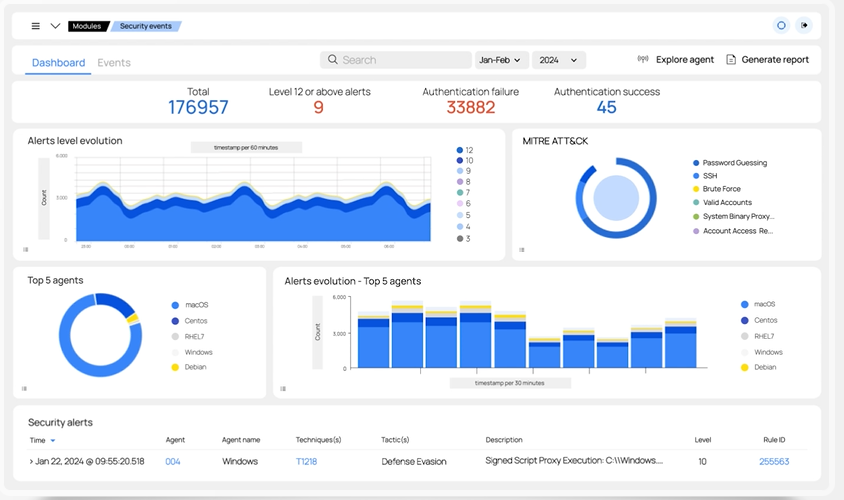

Outline:
 
1. Create necessary Lab.
	- Create a internal vSwitch.
	- launch and bind dhcpsrv to said switch.
	- create the hyper-v VM, both the wazuh-server and the windows10 client.
2. Download wazuh-agent, sysmon, and winlogbeat (see links at bottom of page)
3. Configure, install, and deploy them on your system
4. Control file outputs, what gets monitored, and more.


So what will this achieve? Well it will probably give ME a little bit more insight in the tool and how to work it. If it helps you too, great!


Tools needed or used by me for this lab:   
- dhcpsrv: 			https://www.dhcpserver.de/cms/   
- hyper-v: 			https://learn.microsoft.com/en-us/virtualization/hyper-v-on-windows/quick-start/enable-hyper-v   
- wazuh (ova): 		https://documentation.wazuh.com/current/deployment-options/virtual-machine/virtual-machine.html   
- winlogbeat:		https://www.elastic.co/downloads/beats/winlogbeat   
- sysmon: 			https://learn.microsoft.com/en-us/sysinternals/downloads/sysmon    
- starwind v2v/p2v:	https://www.starwindsoftware.com/starwind-v2v-converter   
- 7zip: 			https://www.7-zip.org/


# .
In this guide I won't specify how and where to create a Windows 10 machine. You'll have to do that on your own.

# Wazuh Server
Since I'm a livid Hyper-V user, my lab will consist of a bunch of hyper-v VM's.   
It is still possible to perform these labs with VirtualBox (OVA's) or other virtualization software.

- Download the OVA and extract the vmdk using 7zip.
- Convert it using starwind v2v
	- local file -> VHD(X) -> local file -> dynamic
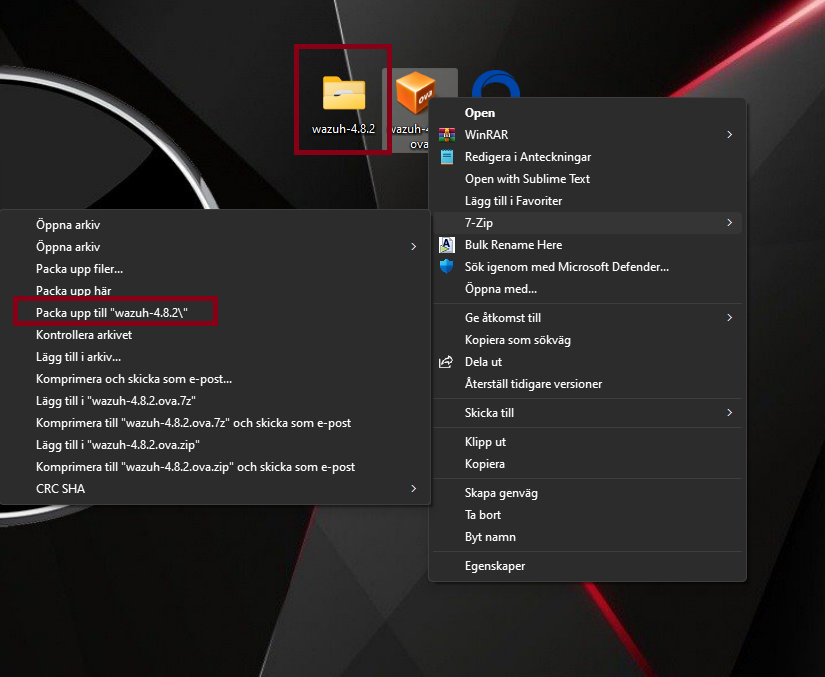

- Grab the newly created vhdx and add it to a GENERATION #1 system in Hyper-V.   
Make sure it's connected to your newly created vSwitch. In my case it is named "vEthernet (MDT-net)". Set a static IP.
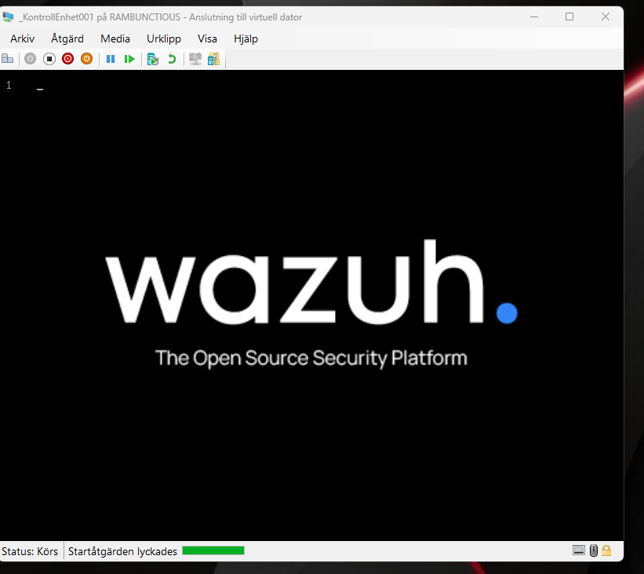

- The login credentials for the machine and ssh. NOT the web-interface.   
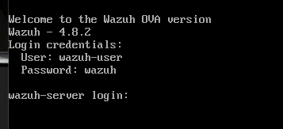

- Create a dhcpsrv config. Read up on the dhcpsrv on the website. This is my config.
```bash
[SETTINGS]
IPPOOL_1=10.25.0.101-255
IPBIND_1="vEthernet (MDT-net)"
AssociateBindsToPools=1
Trace=1
DeleteOnRelease=1
ExpiredLeaseTimeout=3600
InstallAsService=7
ClearClientsOnStartup=0
AllowDNSQuery=1

[GENERAL]
LEASETIME=86400
NODETYPE=8
SUBNETMASK=255.255.255.0
ROUTER_0=10.25.0.254
DNS_1=10.25.0.254

[DNS-SETTINGS]
EnableDNS=1

[HTTP-SETTINGS]
EnableHTTP=1
ROOT=D:\<redacted>\<redacted>\_DHCP\wwwroot

######################
## STATIC ADDRESSES ##
######################

[28-00-AF-98-74-E7]
IPADDR=10.25.0.254
Hostname=MDT-net-root
Index=666

[00-15-5D-26-81-12]
#[00-15-5D-26-81-07]
IPADDR=10.25.0.1
Hostname=KontrollEnhet001
Index=666

#################
## NEW CLIENTS ##
#################


```

- Log into wazuh using admin:admin @ https://10.25.0.1 (in this case)   
   
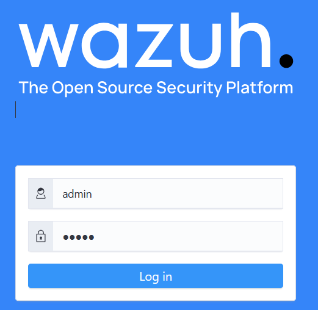   

- Add a "endpoint group" and settings.
	- Go to "Server management" -> Endpoint groups -> Add new group. Then edit the group (press the pen)

agent.conf
```xml
<agent_config>
	<!-- Extra logging SYSMON -->
	<localfile>
		<location>Microsoft-Windows-Sysmon/Operational</location>
		<log_format>eventchannel</log_format>
	</localfile>
	<!-- File integrity monitoring -->
	<syscheck>
		<disabled>yes</disabled>
	</syscheck>
	<!-- Policy monitoring -->
	<rootcheck>
		<disabled>yes</disabled>
	</rootcheck>
	<!-- Security Configuration Assessment -->
	<sca>
		<enabled>no</enabled>
	</sca>
	<!-- System inventory -->
	<wodle name="syscollector">
		<disabled>no</disabled>
		<interval>1h</interval>
		<scan_on_start>yes</scan_on_start>
		<hardware>yes</hardware>
		<os>yes</os>
		<network>yes</network>
		<packages>yes</packages>
		<ports all="yes">yes</ports>
		<processes>yes</processes>
		<!-- check all ports! -->
		<!-- Database synchronization settings -->
		<synchronization>
			<max_eps>10</max_eps>
		</synchronization>
	</wodle>
	<!-- Active response -->
	<active-response>
		<disabled>yes</disabled>
		<ca_store>wpk_root.pem</ca_store>
		<ca_verification>yes</ca_verification>
	</active-response>
	<!-- Choose between plain or json format (or both) for internal logs -->
	<logging>
		<log_format>json</log_format>
	</logging>
</agent_config>
```

- Add sysmon custom rules handling for wazuh.
	- Go to "Server management" -> Rules -> Custom rules -> add new rules file.
	- Here is my config. I mapped missing sysmon ID's to wazuh marked "pwned by jml".    
	I have currently found no way to map EID 27,28,29 as it seems wazuh 4.8.2 does not currently support them by default.

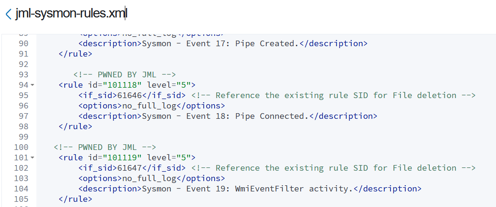

```xml
<!-- Log Sysmon Alerts -->
<group name="sysmon">
    <rule id="101101" level="5">
        <if_sid>61603</if_sid>
        <options>no_full_log</options>
        <description>Sysmon - Event 1: Process creation.</description>
    </rule>
    <rule id="101102" level="5">
        <if_sid>61604</if_sid>
        <options>no_full_log</options>
        <description>Sysmon - Event 2: A process changed a file creation time.</description>
    </rule>
    <rule id="101103" level="5">
        <if_sid>61605</if_sid>
        <options>no_full_log</options>
        <description>Sysmon - Event 3: Network connection.</description>
    </rule>
    <rule id="101104" level="5">
        <if_sid>61606</if_sid>
        <options>no_full_log</options>
        <description>Sysmon - Event 4: Sysmon service state changed.</description>
    </rule>
    <rule id="101105" level="5">
        <if_sid>61607</if_sid>
        <options>no_full_log</options>
        <description>Sysmon - Event 5: Process terminated.</description>
    </rule>
    <rule id="101106" level="5">
        <if_sid>61608</if_sid>
        <options>no_full_log</options>
        <description>Sysmon - Event 6: Driver loaded.</description>
    </rule>
    <rule id="101107" level="5">
        <if_sid>61609</if_sid>
        <options>no_full_log</options>
        <description>Sysmon - Event 7: Image loaded.</description>
    </rule>
    <rule id="101108" level="5">
        <if_sid>61610</if_sid>
        <options>no_full_log</options>
        <description>Sysmon - Event 8: CreateRemoteThread.</description>
    </rule>
    <rule id="101109" level="5">
        <if_sid>61611</if_sid>
        <options>no_full_log</options>
        <description>Sysmon - Event 9: RawAccessRead.</description>
    </rule>
    <rule id="101110" level="5"> 
        <if_sid>61612</if_sid>
        <options>no_full_log</options>
        <description>Sysmon - Event 10: ProcessAccess.</description>
    </rule>
    <rule id="101111" level="5">
        <if_sid>61613</if_sid>
        <options>no_full_log</options>
        <description>Sysmon - Event 11: FileCreate.</description>
    </rule>
    <rule id="101112" level="5">
        <if_sid>61614</if_sid>
        <options>no_full_log</options>
        <description>Sysmon - Event 12: RegistryEvent (Object create and delete).</description>
    </rule>
    <rule id="101113" level="5">
        <if_sid>61615</if_sid>
        <options>no_full_log</options>
        <description>Sysmon - Event 13: RegistryEvent (Value Set).</description>
    </rule>
    <rule id="101114" level="5">
        <if_sid>61616</if_sid>
        <options>no_full_log</options>
        <description>Sysmon - Event 14: RegistryEvent (Key and Value Rename).</description>
    </rule>
    <rule id="101115" level="5">
        <if_sid>61617</if_sid>
        <options>no_full_log</options>
        <description>Sysmon - Event 15: FileCreateStreamHash.</description>
    </rule>
    
    <!-- PWNED BY JML -->
    <rule id="101116" level="5">
        <if_sid>61644</if_sid> <!-- Reference the existing rule SID for File deletion -->
        <options>no_full_log</options>
        <description>Sysmon - Event 16: Sysmon configuration changed.</description>
    </rule>

    <!-- PWNED BY JML -->
    <rule id="101117" level="5">
        <if_sid>61645</if_sid> <!-- Reference the existing rule SID for File deletion -->
        <options>no_full_log</options>
        <description>Sysmon - Event 17: Pipe Created.</description>
    </rule>

       <!-- PWNED BY JML -->
    <rule id="101118" level="5">
        <if_sid>61646</if_sid> <!-- Reference the existing rule SID for File deletion -->
        <options>no_full_log</options>
        <description>Sysmon - Event 18: Pipe Connected.</description>
    </rule>

   <!-- PWNED BY JML -->
    <rule id="101119" level="5">
        <if_sid>61647</if_sid> <!-- Reference the existing rule SID for File deletion -->
        <options>no_full_log</options>
        <description>Sysmon - Event 19: WmiEventFilter activity.</description>
    </rule>

    <!-- PWNED BY JML -->
    <rule id="101120" level="5">
        <if_sid>61648</if_sid> <!-- Reference the existing rule SID for File deletion -->
        <options>no_full_log</options>
        <description>Sysmon - Event 20: WmiEventConsumer activity.</description>
    </rule>

    <!-- PWNED BY JML -->
    <rule id="101121" level="5">
        <if_sid>61649</if_sid> <!-- Reference the existing rule SID for File deletion -->
        <options>no_full_log</options>
        <description>Sysmon - Event 21: WmiEventConsumerToFilter activity.</description>
    </rule>

    <rule id="101100" level="5">
        <if_sid>61600</if_sid>
        <field name="win.system.eventID">^22$</field>
        <description>Sysmon - Event 22: DNS Query.</description>
        <options>no_full_log</options>
    </rule>

    <!-- PWNED BY JML -->
    <rule id="101123" level="5">
        <if_sid>61651</if_sid> <!-- Reference the existing rule SID for File deletion -->
        <options>no_full_log</options>
        <description>Sysmon - Event 23: File deleted and archived.</description>
    </rule>

    <!-- PWNED BY JML -->
    <rule id="101124" level="5">
        <if_sid>61652</if_sid> <!-- Reference the existing rule SID for File deletion -->
        <options>no_full_log</options>
        <description>Sysmon - Event 24: Clipboard change.</description>
    </rule>

    <!-- PWNED BY JML -->
    <rule id="101125" level="5">
        <if_sid>61653</if_sid> <!-- Reference the existing rule SID for File deletion -->
        <options>no_full_log</options>
        <description>Sysmon - Event 25: Process tampering - Image change.</description>
    </rule>

    <!-- PWNED BY JML -->
    <rule id="101126" level="5">
        <if_sid>61654</if_sid> <!-- Reference the existing rule SID for File deletion -->
        <options>no_full_log</options>
        <description>Sysmon - Event 26: File deletion detected.</description>
    </rule>

    <!-- Coming soon ....
    <rule id="101127" level="5">
        <if_sid>6165X</if_sid>
        <options>no_full_log</options>
        <description>Sysmon - Event 27: FileBlockExecutable </description>
    </rule>
    -->

    <!-- Coming soon ....
    <rule id="101128" level="5">
        <if_sid>6165X</if_sid>
        <options>no_full_log</options>
        <description>Sysmon - Event 28: FileBlockShredding. </description>
    </rule>
    -->

    <!-- Coming soon ....
    <rule id="101129" level="5">
        <if_sid>6165X</if_sid>
        <options>no_full_log</options>
        <description>Sysmon - Event 29: FileExecutableDeleted. </description>
    </rule>
    -->

</group>

```

	- Restart the wazuh manager.
	- DONE

- Deploy an agent
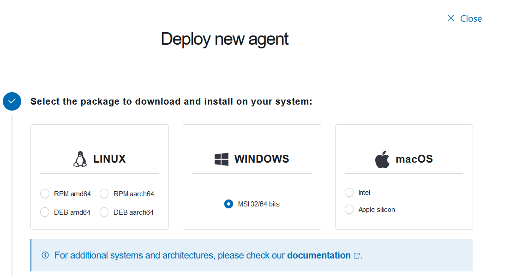
If you're anything like me I like to do stuff offline. If you follow the steps using the in-house "deploy-and-agent"-solution you get a neat powershell command that downloads a msi-package, and installs it with defined variables. Like so:
```
Invoke-WebRequest -Uri https://packages.wazuh.com/4.x/windows/wazuh-agent-4.8.2-1.msi -OutFile ${env.tmp}\wazuh-agent; msiexec.exe /i ${env.tmp}\wazuh-agent /q WAZUH_MANAGER='10.25.0.1' WAZUH_AGENT_GROUP='default' 
```
But since I'm offline, I'll just grab the wazuh agent from the website and deploy it manually on a client. You could just set up your own webserver, do a little change in the powershell cmd, et voila.

I did it manually with : (THIS IS TO BE DONE IN THE WINDOWS CLIENT. SE FURTHER DOWN)
```
msiexec /i wazuh-agent-4.8.2-1.msi /q WAZUH_MANAGER="10.25.0.1" WAZUH_AGENT_GROUP="default"
```
Then start the service
```
NET START WazuhSvc   // or
start-service wazuh  // or
start-service wazuhsvc
```
Once the agent get's connected to the server it will start monitoring the logs. You'll also be served with the wazuh-server agent 000 logs, from the actual server.

# Windows Client (Winlogbeat, sysmon, wazuh-agent)

- Download winlogbeat, sysmon, and the wazuh-agent to the windows 10 client.
- Place them all in a neat little folder.

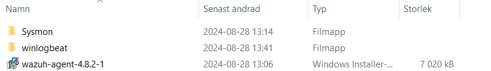   

- Install sysmon using a configuration
In my case the config is empty except for EventID 11, 16, 23.
By empty I mean the categories and rulegroups are there, they are just not utilized.
You could install sysmon with "sysmon-modular" config (look it up). It will pretty much give you whatever you need.
```
.\Sysmon64.exe -accepteula -c .\jml-sysmonconfig-sensor.xml
```
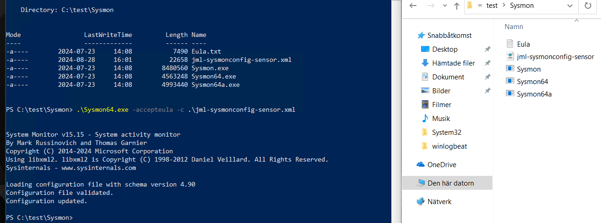   

```xml
<!--
  FILTERING: Filter conditions available for use are: is,is not,contains,contains any,is any,contains all,excludes,excludes any,excludes all,begin with,not begin with,end with,not end with,less than,more than,image
  
  COMPOUND RULE GROUP EXAMPLE:
  <Rule groupRelation="and" name="">
     <ID condition="contains">SomeValue</ID>
     <Description condition="contains">SomeValue</Description>
  </Rule>
-->

<Sysmon schemaversion="4.90">

	<HashAlgorithms>*</HashAlgorithms>
	<DnsLookup>False</DnsLookup>
	<CheckRevocation>False</CheckRevocation>

	<EventFiltering>

		<!--SYSMON EVENT ID 255 : Error report []-->
		<!--DATA: UtcTime, ID, Description-->

		<!--SYSMON EVENT ID 1 : Process Create [ProcessCreate]-->
		<!--DATA: RuleName, UtcTime, ProcessGuid, ProcessId, Image, FileVersion, Description, Product, Company, OriginalFileName, CommandLine, CurrentDirectory, User, LogonGuid, LogonId, TerminalSessionId, IntegrityLevel, Hashes, ParentProcessGuid, ParentProcessId, ParentImage, ParentCommandLine, ParentUser-->

		<RuleGroup name="ProcessCreate_RG_001" groupRelation="or">
			<ProcessCreate onmatch="include">
			</ProcessCreate>
		</RuleGroup>

		<!--SYSMON EVENT ID 2 : File creation time changed [FileCreateTime]-->
		<!--DATA: RuleName, UtcTime, ProcessGuid, ProcessId, Image, TargetFilename, CreationUtcTime, PreviousCreationUtcTime, User-->

		<RuleGroup name="FileCreateTime_RG_001" groupRelation="or">
			<FileCreateTime onmatch="include">
			</FileCreateTime>
		</RuleGroup>

		<!--SYSMON EVENT ID 3 : Network connection detected [NetworkConnect]-->
		<!--DATA: RuleName, UtcTime, ProcessGuid, ProcessId, Image, User, Protocol, Initiated, SourceIsIpv6, SourceIp, SourceHostname, SourcePort, SourcePortName, DestinationIsIpv6, DestinationIp, DestinationHostname, DestinationPort, DestinationPortName-->

		<RuleGroup name="NetworkConnect_RG_001" groupRelation="or">
			<NetworkConnect onmatch="include">
			</NetworkConnect>
		</RuleGroup>

		<!--SYSMON EVENT ID 4 : Sysmon service state changed []-->
		<!--DATA: UtcTime, State, Version, SchemaVersion-->

		<!--SYSMON EVENT ID 5 : Process terminated [ProcessTerminate]-->
		<!--DATA: RuleName, UtcTime, ProcessGuid, ProcessId, Image, User-->

		<RuleGroup name="ProcessTerminate_RG_001" groupRelation="or">
			<ProcessTerminate onmatch="include">
			</ProcessTerminate>
		</RuleGroup>

		<!--SYSMON EVENT ID 6 : Driver loaded [DriverLoad]-->
		<!--DATA: RuleName, UtcTime, ImageLoaded, Hashes, Signed, Signature, SignatureStatus-->

		<RuleGroup name="DriverLoad_RG_001" groupRelation="or">
			<DriverLoad onmatch="include">
			</DriverLoad>
		</RuleGroup>

		<!--SYSMON EVENT ID 7 : Image loaded [ImageLoad]-->
		<!--DATA: RuleName, UtcTime, ProcessGuid, ProcessId, Image, ImageLoaded, FileVersion, Description, Product, Company, OriginalFileName, Hashes, Signed, Signature, SignatureStatus, User-->

		<RuleGroup name="ImageLoad_RG_001" groupRelation="or">
			<ImageLoad onmatch="include">
			</ImageLoad>
		</RuleGroup>

		<!--SYSMON EVENT ID 8 : CreateRemoteThread detected [CreateRemoteThread]-->
		<!--DATA: RuleName, UtcTime, SourceProcessGuid, SourceProcessId, SourceImage, TargetProcessGuid, TargetProcessId, TargetImage, NewThreadId, StartAddress, StartModule, StartFunction, SourceUser, TargetUser-->

		<RuleGroup name="CreateRemoteThread_RG_001" groupRelation="or">
			<CreateRemoteThread onmatch="include">
			</CreateRemoteThread>
		</RuleGroup>

		<!--SYSMON EVENT ID 9 : RawAccessRead detected [RawAccessRead]-->
		<!--DATA: RuleName, UtcTime, ProcessGuid, ProcessId, Image, Device, User-->

		<RuleGroup name="RawAccessRead_RG_001" groupRelation="or">
			<RawAccessRead onmatch="include">
			</RawAccessRead>
		</RuleGroup>

		<!--SYSMON EVENT ID 10 : Process accessed [ProcessAccess]-->
		<!--DATA: RuleName, UtcTime, SourceProcessGUID, SourceProcessId, SourceThreadId, SourceImage, TargetProcessGUID, TargetProcessId, TargetImage, GrantedAccess, CallTrace, SourceUser, TargetUser-->

		<RuleGroup name="ProcessAccess_RG_001" groupRelation="or">
			<ProcessAccess onmatch="include">
			</ProcessAccess>
		</RuleGroup>

		<!--SYSMON EVENT ID 11 : File created [FileCreate]-->
		<!--DATA: RuleName, UtcTime, ProcessGuid, ProcessId, Image, TargetFilename, CreationUtcTime, User-->

		<RuleGroup name="FileCreate_RG_001" groupRelation="or">  
  			<FileCreate onmatch="include">  
  				<Rule groupRelation="and" name="Filskapande">  
     					<TargetFilename condition="contains any">C:\Users\Administratör\Desktop</TargetFilename>				  
     				</Rule>			  
    			</FileCreate>  
		</RuleGroup>

		<!--SYSMON EVENT ID 12 : Registry object added or deleted [RegistryEvent]-->
		<!--DATA: RuleName, EventType, UtcTime, ProcessGuid, ProcessId, Image, TargetObject, User-->

		<!--SYSMON EVENT ID 13 : Registry value set [RegistryEvent]-->
		<!--DATA: RuleName, EventType, UtcTime, ProcessGuid, ProcessId, Image, TargetObject, Details, User-->

		<!--SYSMON EVENT ID 14 : Registry object renamed [RegistryEvent]-->
		<!--DATA: RuleName, EventType, UtcTime, ProcessGuid, ProcessId, Image, TargetObject, NewName, User-->

		<RuleGroup name="RegistryEvent_RG_001" groupRelation="or">
			<RegistryEvent onmatch="include">
			</RegistryEvent>
		</RuleGroup>

		<!--SYSMON EVENT ID 15 : File stream created [FileCreateStreamHash]-->
		<!--DATA: RuleName, UtcTime, ProcessGuid, ProcessId, Image, TargetFilename, CreationUtcTime, Hash, Contents, User-->

		<RuleGroup name="FileCreateStreamHash_RG_001" groupRelation="or">
			<FileCreateStreamHash onmatch="include">
			</FileCreateStreamHash>
		</RuleGroup>

		<!--SYSMON EVENT ID 16 : Sysmon config state changed []-->
		<!--DATA: UtcTime, Configuration, ConfigurationFileHash-->

		<!--SYSMON EVENT ID 17 : Pipe Created [PipeEvent]-->
		<!--DATA: RuleName, EventType, UtcTime, ProcessGuid, ProcessId, PipeName, Image, User-->

		<!--SYSMON EVENT ID 18 : Pipe Connected [PipeEvent]-->
		<!--DATA: RuleName, EventType, UtcTime, ProcessGuid, ProcessId, PipeName, Image, User-->

		<RuleGroup name="PipeEvent_RG_001" groupRelation="or">
			<PipeEvent onmatch="include">
			</PipeEvent>
		</RuleGroup>

		<!--SYSMON EVENT ID 19 : WmiEventFilter activity detected [WmiEvent]-->
		<!--DATA: RuleName, EventType, UtcTime, Operation, User, EventNamespace, Name, Query-->

		<!--SYSMON EVENT ID 20 : WmiEventConsumer activity detected [WmiEvent]-->
		<!--DATA: RuleName, EventType, UtcTime, Operation, User, Name, Type, Destination-->

		<!--SYSMON EVENT ID 21 : WmiEventConsumerToFilter activity detected [WmiEvent]-->
		<!--DATA: RuleName, EventType, UtcTime, Operation, User, Consumer, Filter-->

		<RuleGroup name="WmiEvent_RG_001" groupRelation="or">
			<WmiEvent onmatch="include">
			</WmiEvent>
		</RuleGroup>

		<!--SYSMON EVENT ID 22 : Dns query [DnsQuery]-->
		<!--DATA: RuleName, UtcTime, ProcessGuid, ProcessId, QueryName, QueryStatus, QueryResults, Image, User-->

		<RuleGroup name="DnsQuery_RG_001" groupRelation="or">
		<!--Default to log all and exclude a few common processes-->
		<!--Default to log all and exclude a few common processes-->
      		<DnsQuery onmatch="exclude">
      		</DnsQuery>
		</RuleGroup>

		<!--SYSMON EVENT ID 23 : File Delete archived [FileDelete]-->
		<!--DATA: RuleName, UtcTime, ProcessGuid, ProcessId, User, Image, TargetFilename, Hashes, IsExecutable, Archived-->

		<RuleGroup name="FileDelete_RG_001" groupRelation="or">
			<FileDelete onmatch="include">
			</FileDelete>
		</RuleGroup>

		<!--SYSMON EVENT ID 24 : Clipboard changed [ClipboardChange]-->
		<!--DATA: RuleName, UtcTime, ProcessGuid, ProcessId, Image, Session, ClientInfo, Hashes, Archived, User-->

		<RuleGroup name="ClipboardChange_RG_001" groupRelation="or">
			<ClipboardChange onmatch="include">
			</ClipboardChange>
		</RuleGroup>

		<!--SYSMON EVENT ID 25 : Process Tampering [ProcessTampering]-->
		<!--DATA: RuleName, UtcTime, ProcessGuid, ProcessId, Image, Type, User-->

		<RuleGroup name="ProcessTampering_RG_001" groupRelation="or">
			<ProcessTampering onmatch="include">
			</ProcessTampering>
		</RuleGroup>

		<!--SYSMON EVENT ID 26 : File Delete logged [FileDeleteDetected]-->
		<!--DATA: RuleName, UtcTime, ProcessGuid, ProcessId, User, Image, TargetFilename, Hashes, IsExecutable-->

		<RuleGroup name="FileDeleteDetected_RG_001" groupRelation="or">  
		    <FileDeleteDetected onmatch="include">  
		        <Rule groupRelation="and" name="Filborttagning">  
		            <TargetFilename condition="contains any">C:\Users\Administratör\Desktop</TargetFilename>				  
		        </Rule>			  
		    </FileDeleteDetected>  
		</RuleGroup>

	

		<!--SYSMON EVENT ID 27 : File Block Executable [FileBlockExecutable]-->
		<!--DATA: RuleName, UtcTime, ProcessGuid, ProcessId, User, Image, TargetFilename, Hashes-->

		<RuleGroup name="FileBlockExecutable_RG_001" groupRelation="or">
			<FileBlockExecutable onmatch="include">
			</FileBlockExecutable>
		</RuleGroup>

		<!--SYSMON EVENT ID 28 : File Block Shredding [FileBlockShredding]-->
		<!--DATA: RuleName, UtcTime, ProcessGuid, ProcessId, User, Image, TargetFilename, Hashes, IsExecutable-->

		<RuleGroup name="FileBlockShredding_RG_001" groupRelation="or">
			<FileBlockShredding onmatch="include">
			</FileBlockShredding>
		</RuleGroup>

		<!--SYSMON EVENT ID 29 : File Executable Detected [FileExecutableDetected]-->
		<!--DATA: RuleName, UtcTime, ProcessGuid, ProcessId, User, Image, TargetFilename, Hashes-->

		<RuleGroup name="FileExecutableDetected_RG_001" groupRelation="or">
			<FileExecutableDetected onmatch="include">
			</FileExecutableDetected>
		</RuleGroup>

	</EventFiltering>

</Sysmon>

```

- Open eventvwr and look at your new sysmon logs.
	- You'll find them @applications and service logs -> Microsoft -> Windows -> Sysmon -> Operational.
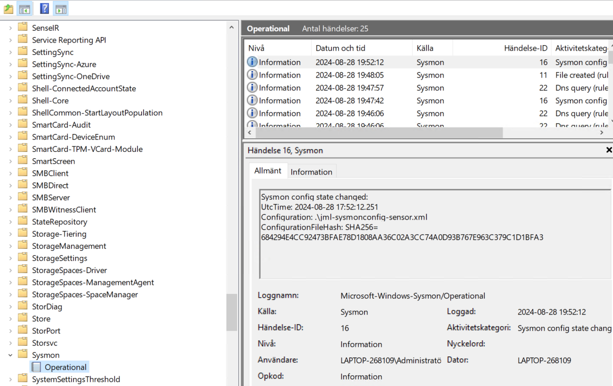   

- Go check the logs in the wazuh web-interface
	- Go to Threat Intelligence -> Threat Hunting -> Events
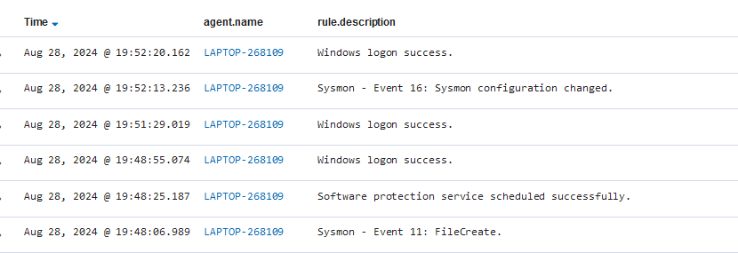   

### OK, so far so good. Now install Winlogbeat.

- Either run "install-service-winlogbeat.ps1" to install it as a service, or just run the .exe
- but first, configure the file-output. Since I haven't (YET) figured out a way to send the logs directly into wazuhs log-collector...filebeat...wazuh-manager...what have you...
I currently save the logs into a file on the desktop for manual editing.

winlogbeat.yml
```bash
winlogbeat.event_logs:
  - name: Microsoft-Windows-Sysmon/Operational
    # event_id: 1, 2, 3, 4, 5, 6, 7, 8, 9, 10, 11, 12, 13, 14, 15, 16, 17, 18, 19, 20, 21, 22, 23, 24, 25, 26, 27, 28, 29, 30, 31, 32
    # You can specify specific event IDs you want to capture

output.file:
  path: C:\Users\Administratör\Desktop
  filename: winlogbeat
  keepfiles: 7
  permissions: 0644
```
- Files will get logged like so.
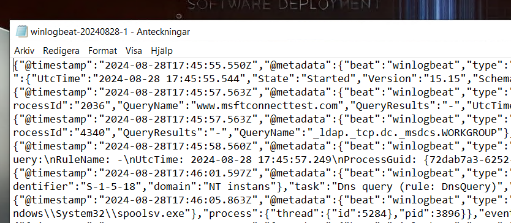   


# HERE ENDS MY KNOWLEDGE (FOR NOW) :)

### Goals

1. Send winlogbeats to wazuh or somehow import them manually.
2. Add sysmon id's for applications and usb-storage monitoring
3. Others...
